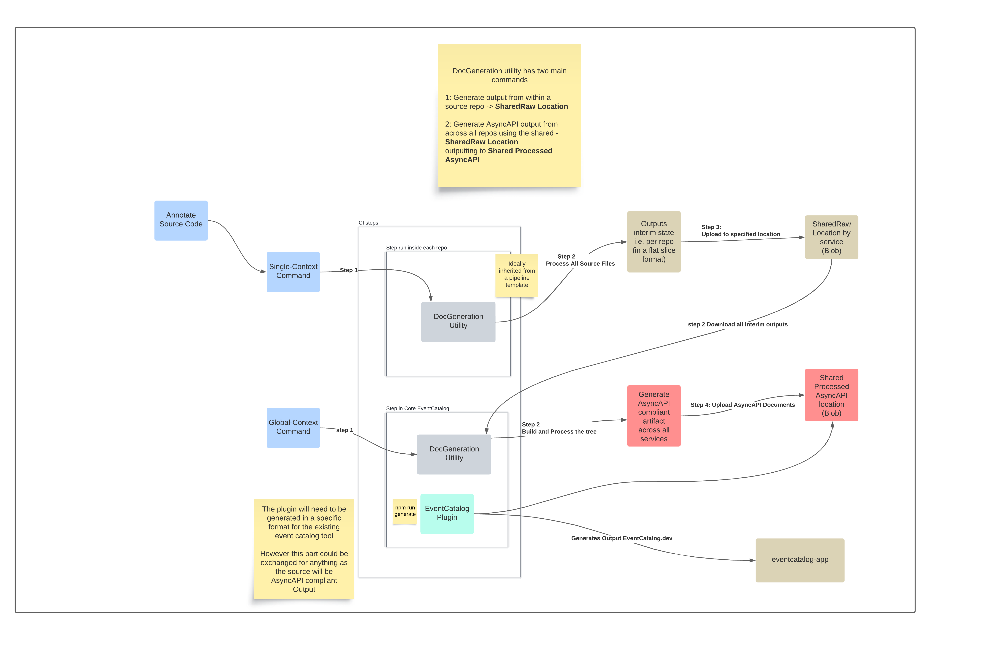

# async-api-generator

This tool parses source code - of any type and looks for tags / annotations to extract expressions and assign them to GenDoc statements.

The goal of this utility is twofold:

- produce an interim state from a single service/application and convert to [AsyncAPI](https://www.asyncapi.com) spec

- produce a holistic view across all application/service emitted AsyncAPI documents to provide a wider view

The driver is to remove manual creation/maintanence of AsyncAPI Specs and have them be generated from code - which would also ~force~ encourage documentation of code to live with code and hence making it easier to modify relevant code and accompanying documentation.

_Limitations by design:_

- requires a closing tag as the source can be of any type and formatting is not guaranteed. Essentially using things like `{` or cursor column indicator, wouldn't be reliable enough as not everyone may have uniform formatting.

_High level flow_

Living documentation [link](https://lucid.app/lucidspark/4d09749b-ad86-456b-a5ad-2f9e70a2b546/edit?viewport_loc=-1181%2C-734%2C4250%2C2266%2C0_0&invitationId=inv_bc6af9c8-3b41-4b00-b535-255d109f0afb)

## Flow Overview

Walk the directory and create a list of all source files - excluding specified such as bin, dist, vendor, node_modules, etc...

running each file as a source through a lexer i.e. performing a lexical analysis, where we identify tokens and build an AST (Abstract Syntax Tree)

> each file can be done in a separate go routine as there is no intrinsic relationship between them at this stage. 

Here is a more [detailed internal overview](./docs/internals.md)

### Usage

See [usage](./docs/usage.md) for more details.

## AsyncAPI standard

[AsyncAPI at Next](./docs/asyncapi.md)

## Local development

To run the full flow locally you can use the local:// storage protocol.

See usage [local example](./docs/usage.md#LocalExample) for an example of how to work with and experiment locally with the outputs.

## Components

For a full view of required components including publishing to the existing event catalog, the AsyncAPI document generator consists of the following auxilary components.

### Schema Generation from DotNet

Download SchemaGenerator for relevant architecture and run binary with required flags, see [here](./src/dotnet/Schema.Generator/README.md) for details.

### EventCatalog binding

The translation of AsyncAPI into an EventCatalog set up. Whilst there are fairly standard mappings between the 2 processes - there are some nuances and requirements, but this [plugin](./src/ts/eventcatalog-plugin-doc-generator-azblob/README.md) will be used to generate the eventcatalog compliant output.

See on [NPM](TODO) and how to use it insid the existing eventcatalog app.

### Infrastructure

For remote publishing of generated interim and processed AsyncAPI documents a centralised bucket is required. The [definition](./terraform/examples/full/full.tf) and description of the flow can be found [here](./terraform/README.md).

## Evolution

Once satisfactory outcomes are achieved, the next step could be to generate clients directly. There are various options out there:

- [Official AsyncAPI Generators](https://github.com/asyncapi/generator)
- Write own?
- There will be use cases when a single repo contains an entire definition needed for the doc generation to work, i.e. it will contain all the infrastructure/notes/models/schemas examples. IN this case a wrap around command can be exposed to combine the interim output generation with reading it and generating the full AsyncAPI. 
    - E.g. the backstage.io required CRD can embed an entire AsyncAPI doc inside its spec payload.

### Still needing attention

- the merging of content within the same level could use a bit of work, namely not overwriting content defined in multiple places and perform a non-destructive merge where possible.
- `servers` section inside the main `service` definition
- `wip`: naming of operations and category types to allow for a more generic labelling types. e.g. categoryType of pubOperation is actually an eventcatalog subscriber.

#### schemagenerator

Dotnet CLI to inspect and generate schemas and JSON payload samples. 

TODO:
    - Generated Samples when includes datetime
    - ENUMs in the generated SCHEMAs can sometimes come up as empty `""`
