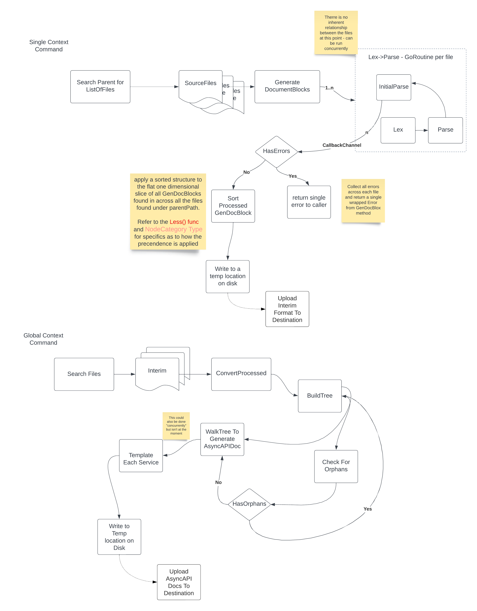
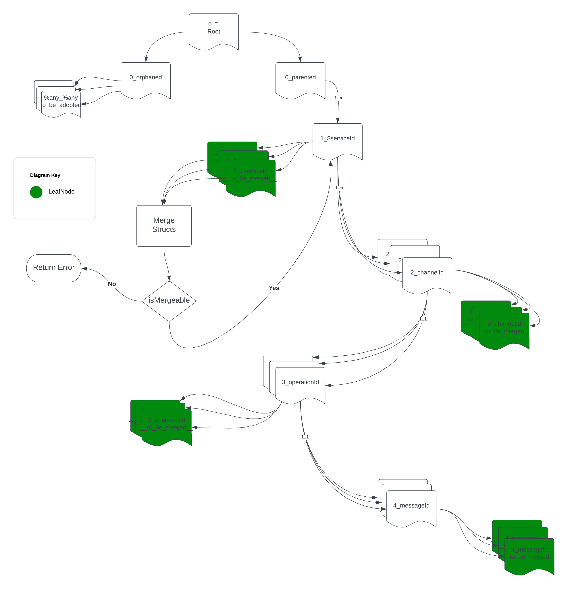
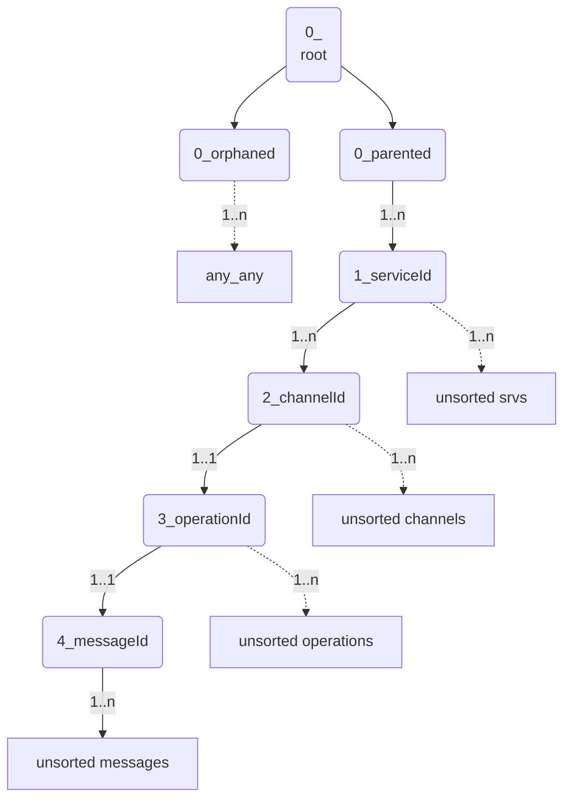

# Internals

## Lexer

TOKENs are kept to the following types - `token.TokenType`  - not listed as the list is likely to change/grow.

Special consideration will need to be given to files that are not able to contain comments or anything outside of their existing syntax - e.g. .json most commonly containing schemas. 

> these cases a convention will need to be followed where by the name of the message that it is describing must be in the name of the file.

## Parser

Not using an existing parser generator like CGF, BNF, or EBNF is on purposes as the input source will only ever really be composed of parts we care about i.e. `gendoc` markers their beginning and end and what they enclose within them as text.

We'll use the overly simplified Pratt Parser (top down method) as we'll have no need to for expression parsing only statement nodes creation with the associated/helper attributes.

[more...]()

### Generation

Once a flat list of statements (`[]GenDocBlock`) is ready we then need to sort it in order of precedence. Precedence is set based on `category` (shorthand `c`) found on an annotation.

[more...]()

once sorted we need to build an interim tree, as at this point we have no idea how many nodes there will be, it has to be an `n-ary tree`

## Gendoc Tree

The tree looks like the below diagram. 

Then highlights the order in which it's walked. It is using the __BFS (BreadthFirstSearch) algorithm__ to walk each level and perform the merging of information from all the *leaf*  nodes.

Also worth noting is that it is using an internal indexer for quicker O(n) lookups when performing the sort. The tree is walked multiple times to ensure the orphans are assigned to parents in case they weren't in the tree when it was walked previously.

