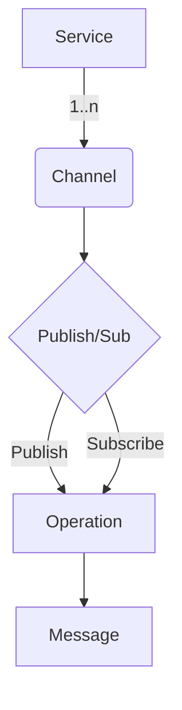

# Notes

- Step 1 extract all gendoc statements a single file?? or json parseable list by service/repo
- step 2 parse all the files only containing step 1 (interim state) building a node tree by precedence where top of the tree has higher importance
  - e.g. service>>channel>operation>message

Diagram in Code

